## Lab 20 - Exploring the IOS-XE RESTCONF API

### Task 1 - Get Full Running Configuration

In this task you will make REST APIs calls to the RESTCONF interface on IOS-XE to obtain a full running configuration represented as JSON.

For these tasks, use the `csr1` device.


##### Step 1

Remote Desktop into your Jump Host and open the Postman application on the Desktop.


##### Step 2

We are now going to construct our first HTTP Request to get the full configuration.

First, set the HTTP request type to `GET`.

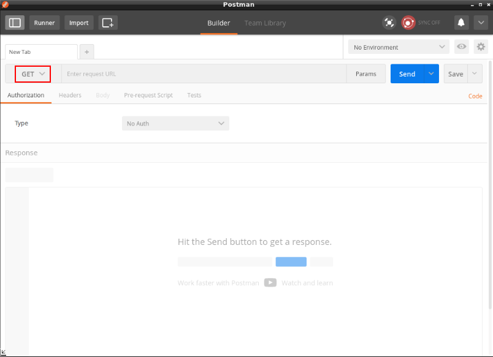

##### Step 3

In the Authorization tab, select `Basic Auth` as **Type** and insert `ntc/ntc123` as username and password.


##### Step 4

In the Headers tab, add two header options `Accept` and `Content-Type` and set both to `application/vnd.yang.data+json`.

These headers are specific to RESTCONF. They mean we are going to be using JSON data, but it is JSON data modeled from YANG models.

Note: YANG is a network modeling language.  It helps define a shcema relevant for network features and configurations.


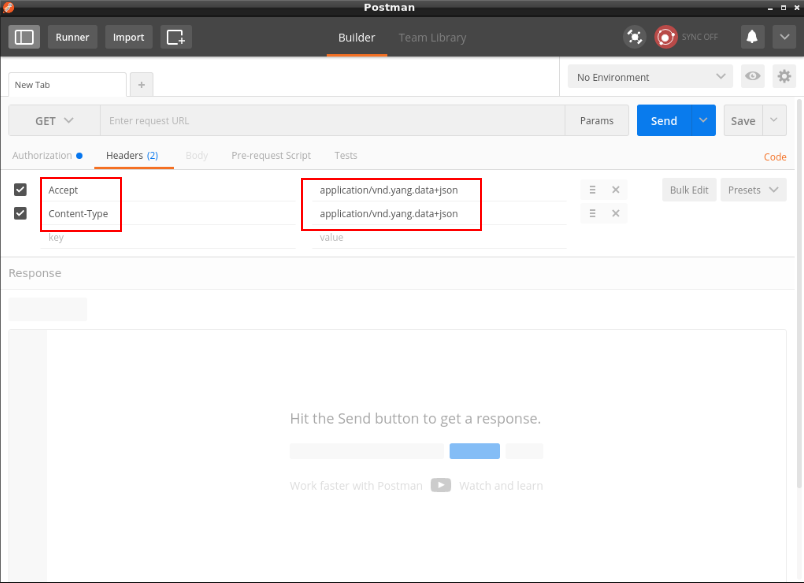

##### Step 5

Add the following URL: `http://csr1/restconf/api/config/native/`.

This is the URL that obtains a fully modeled running configuration using the `ned` data model.

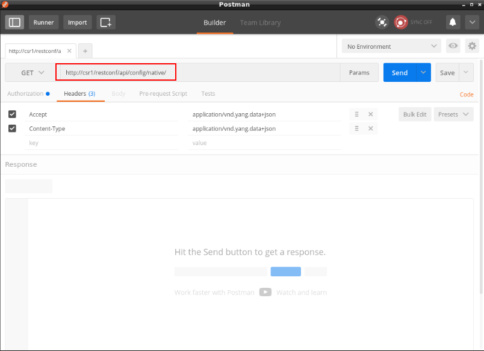

##### Step 6

Click the **Send** button to make the HTTP request.

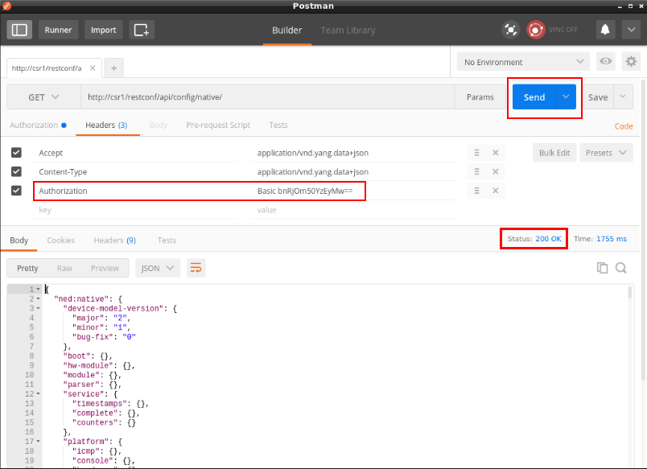

> Note: Postman has authomatically generated a new **Authorization** header option based on what you have inserted into the **Authorization** tab.

Scroll through the response object and take a deeper look.

Note that **Status** code is 200.  This is a standard HTTP Response code and tell us that everything worked.

This is a sample of what you'll see in Postman:

```json
{
  "ned:native": {
    "device-model-version": {
      "major": "2",
      "minor": "1",
      "bug-fix": "0"
    },
    "boot": {},
    "hw-module": {},
    "module": {},
    "parser": {},
    "service": {
      "timestamps": {},
      "complete": {},
      "counters": {}
    },
    "platform": {
      "icmp": {},
      "console": {},
      "hardware": {},
      "ipsec": {},
      "l2vpn": {},
      "multicast": {
        "oce": {}
      },
      "qos": {},
      "urpf": {
        "loose": {
          "counter": {
            "ipv4": {},
            "ipv6": {}
          }
        }
      }
    },
    "enable": {},
    "archive": {
      "log": {
        "config": {}
      },
      "path": "bootflash:archive"
    },
    "username": [
      {
        "name": "ntc"
      }
    ],
    "vrf": {
      "definition": [
        {
          "name": "MANAGEMENT"
        }
      ]
    },
    "ip": {
      "arp": {
        "inspection": {
          "log-buffer": {}
        }
      },
      "domain-list": {},
      "icmp": {
        "rate-limit": {}
      },
      "msdp": {
        "password": {},
        "sa-filter": {}
      },
      "domain": {
        "list": {},
        "lookup": false,
        "lookup-settings": {
          "lookup": {}
        },
        "name": "ntc.com"
# output truncated

```


Notice this is technically not all configuration objects.  It has all required keys, but not all children elements. For example, it has interfaces on the system, but not the configuration on each interface.  


##### Step 7

Modify the URL appending `?deep` to it. This is how we can query ALL children objects to see a full response object.

Click the `Send` button again and take a look at the new response object.

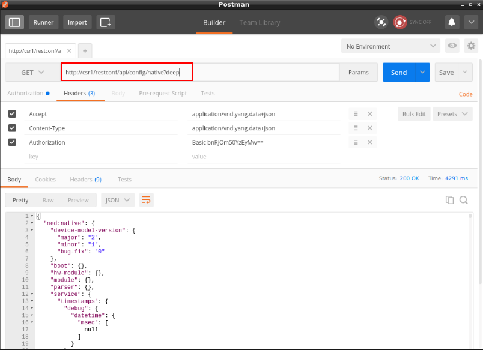

The response is much more verbose:

```
{
  "ned:native": {
    "device-model-version": {
      "major": "2",
      "minor": "1",
      "bug-fix": "0"
    },
    "boot": {},
    "hw-module": {},
    "module": {},
    "parser": {},
    "service": {
      "timestamps": {
        "debug": {
          "datetime": {
            "msec": [
              null
            ]
          }
        },
        "log": {
          "datetime": {
            "msec": [
              null
            ]
          }
        }
      },
      "complete": {},
      "counters": {}
    },
    "platform": {
      "icmp": {},
      "console": {
        "output": "auto"
      },
      "hardware": {},
      "ipsec": {},
      "l2vpn": {},
      "multicast": {
        "oce": {}
      },
      "qos": {},
      "urpf": {
        "loose": {
          "counter": {
            "ipv4": {},
            "ipv6": {}
          }
        }
      }
    },
    "enable": {},
    "archive": {
      "log": {
        "config": {}
      },
      "path": "bootflash:archive"
    },
    "username": [
      {
        "name": "ntc",
        "password": {
          "encryption": "0",
          "password": "ntc123"
        }
      }
    ],
    "vrf": {
      "definition": [
        {
          "name": "MANAGEMENT",
          "address-family": {
            "ipv4": {
              "mdt": {
                "default": {}
              }
            },
            "ipv6": {}
          }
        }
      ]
    },
    "ip": {
      "arp": {
        "inspection": {
          "log-buffer": {}
        }
      },
      "domain-list": {},
      "icmp": {
        "rate-limit": {}
      },
      "msdp": {
        "password": {},
        "sa-filter": {}
      },
      "domain": {
        "list": {},
        "lookup": false,
        "lookup-settings": {
          "lookup": {}
        },
        "name": "ntc.com"
      },
      "dhcp": {},
      "flow-cache": {},
      "flow-export": {},
      "forward-protocol": {
        "protocol": "nd"
      },
      "ftp": {
        "password": {}
      },
      "http": {
        "authentication": {
          "local": [
            null
          ]
        },
        "server": true,
        "secure-server": true
      },
      "igmp": {
        "ssm-map": {}
      },
      "nat": {
        "inside": {
          "source": {}
        }
      },
      "pim": {
        "spt-threshold-container": {}
      },
      "route": {
        "ip-route-interface-forwarding-list": [
          {
            "prefix": "0.0.0.0",
            "mask": "0.0.0.0",
            "fwd-list": [
              {
                "fwd": "192.168.1.1"
              }
            ]
          }
        ],
        "static": {},
        "vrf": [
          {
            "name": "MANAGEMENT",
            "ip-route-interface-forwarding-list": [
              {
                "prefix": "0.0.0.0",
                "mask": "0.0.0.0",
                "fwd-list": [
                  {
                    "fwd": "10.0.0.2"
                  }
                ]
              }
            ]
          }
        ]
      },
# output truncated

```

### Task 2: Get the Configuration for GigabitEthernet1

##### Step 1

From the previous task you can see that GigabitEthernet interfaces are represented as follows in the response object:

```python
{
    "ned:native": {
         # output removed for example
        "interface": {
            "GigabitEthernet": [
                {
                    "name": "1"
                },
                {
                    "name": "2"
                },
                {
                    "name": "3"
                },
                {
                    "name": "4"
                }
            ]
        },
         truncated for example ]}
}
```

Modify the URL from the previous task to:

```
http://csr1/restconf/api/config/native/interface/GigabitEthernet/1
```

This will just retrieve the configuration for GigE1.

Click **Send** to make the request..

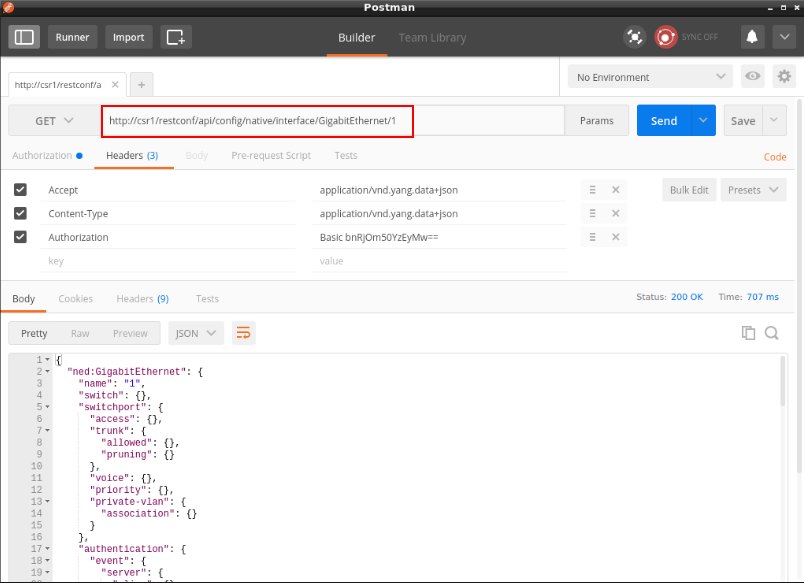

You will see the following response:

```
{
  "ned:GigabitEthernet": {
    "name": "1",
    "switch": {},
    "switchport": {
      "access": {},
      "trunk": {
        "allowed": {},
        "pruning": {}
      },
      "voice": {},
      "priority": {},
      "private-vlan": {
        "association": {}
      }
    },
    "authentication": {
      "event": {
        "server": {
          "alive": {},
          "dead": {
            "action": {}
          }
        },
        "fail": {
          "action": {}
        },
        "no-response": {
          "action": {}
        }
      },
      "timer": {
        "inactivity": {}
      }
    },
    "dot1x": {
      "authenticator": {},
      "supplicant": {}
    },
    "spanning-tree": {},
    "srr-queue": {
      "bandwidth": {}
    },
    "carrier-delay": {},
    "negotiation": {
      "auto": true
    },
    "plim": {
      "ethernet": {
        "vlan": {}
      },
      "qos": {
        "input": {}
      }
    },
    "cemoudp": {},
    "crypto": {},
    "encapsulation": {},
    "isis": {
      "authentication": {},
      "ipv6": {}
    },
    "snmp": {
      "trap": {
        "link-status-capas": {
          "link-status": {}
        }
      }
    },
    "bfd": {},
    "bandwidth": {},
    "cdp": {},
    "mpls": {
      "accounting": {},
      "ldp": {},
      "traffic-eng": {
        "flooding": {}
      }
    },
    "vrf": {
      "forwarding": "MANAGEMENT"
    },
    "ip": {
      "access-group": {},
      "arp": {
        "inspection": {}
      },
      "address": {
        "primary": {
          "address": "10.0.0.51",
          "mask": "255.255.255.0"
        }
      },
      "authentication": {},
      "nhrp": {
        "attribute": {},
        "map": {},
        "nhs": {
          "dynamic": {}
        }
      },
      "ospf": {
        "dead-interval": {},
        "fast-reroute": {}
      },
      "pim": {},
      "igmp": {},
      "dhcp": {
        "relay": {
          "information": {}
        },
        "snooping": {}
      },
      "rsvp": {},
      "verify": {
        "unicast": {}
      },
      "wccp": {
        "web-cache": {},
        "redirect": {}
      }
    },
    "ipv6": {
      "ospf": {
        "authentication": {
          "ipsec": {
            "md5": {},
            "sha1": {}
          }
        },
        "encryption": {
          "ipsec": {
            "ipsec_3des": {},
            "aes-cbc": {
              "aes-cbc-128": {},
              "aes-192": {},
              "aes-256": {}
            }
          }
        }
      },
      "nd": {}
    },
    "lisp": {
      "mobility": {}
    },
    "logging": {},
    "mls": {
      "qos-channel-consistency": {},
      "qos": {}
    },
    "ospfv3": {
      "authentication": {
        "ipsec": {
          "md5": {},
          "sha1": {}
        }
      },
      "encryption": {
        "ipsec": {
          "ipsec_3des": {},
          "aes-cbc": {
            "aes-cbc-128": {},
            "aes-192": {},
            "aes-256": {}
          }
        }
      },
      "manet": {
        "peering": {}
      }
    },
    "power": {},
    "interface_qos": {},
    "service-policy": {
      "type": {}
    },
    "standby": {},
    "storm-control": {
      "broadcast": {}
    },
    "wrr-queue": {},
    "priority-queue": {},
    "rep": {
      "block": {}
    },
    "peer": {
      "default": {
        "ip": {}
      }
    },
    "performance": {}
  }
}
```

##### Step 2

Modify the URL to:

```
http://csr1/restconf/api/config/native/interface/GigabitEthernet/1/ip/address
```

This is used to get IP addresses configuration only. 

Notice how we can simply add to the URL based on the JSON hierarchy in the response.


Click **Send**.

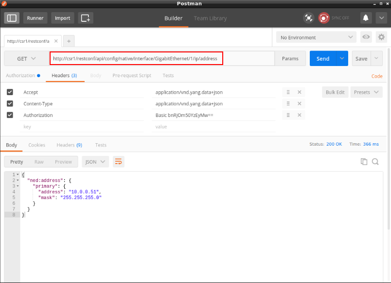


### Task 3: Create a Loopback Interface 

##### Step 1

In this task we want to configure a new loopback interface: Loopback200 interface.

Change the URL to: `http://csr1/restconf/api/config/native/interface`.

Modify the request type to `POST`.

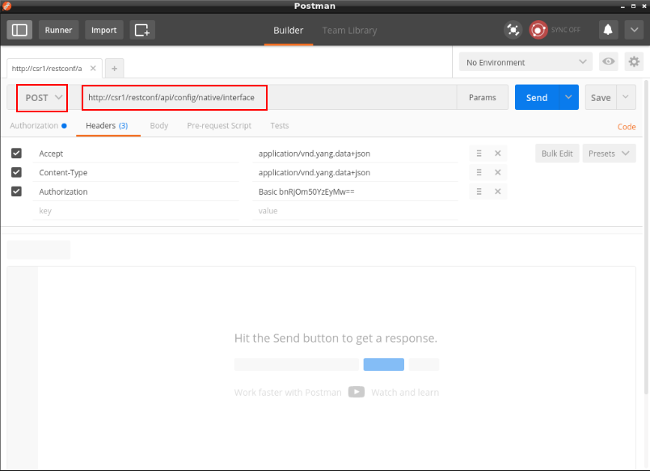


##### Step 2

Whenever you create or update an object, you need to include a JSON body. This body tells the network device, the desired configuration you're trying to update/create.

The following JSON object is going to be used to create the new looopback interface.

```json
{
   "ned:Loopback":{
      "name":200,
      "ip":{
         "address":{
            "primary":{
               "address":"100.200.2.2",
               "mask":"255.255.255.0"
            }
         }
      }
   }
}
```

This object will be used as the **Body** for our POST request. 

Move to the **Body** tab, select the **raw** format and paste the body object into the panel below.

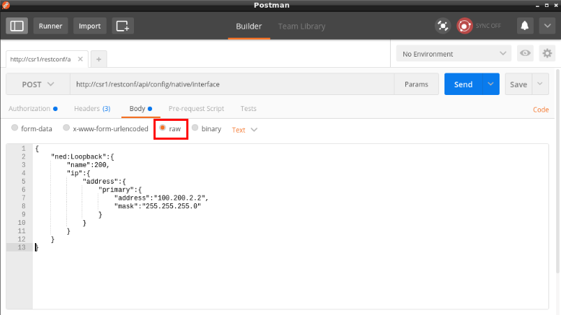

##### Step 3

Click the **Send** button.

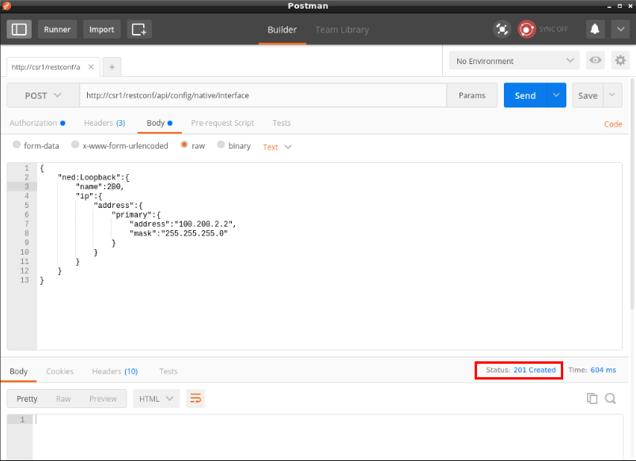

As you can see, the return code is **201 Created**, meaning that the object has been successfully created on the device.

##### Step 4

Send the request again by clicking **Send**.

This time you will see the following response:

```json
{
  "errors": {
    "error": [
      {
        "error-message": "object already exists: /ios:native/ios:interface/ios:Loopback[ios:name='200']",
        "error-urlpath": "/api/config/native/interface",
        "error-tag": "data-exists"
      }
    ]
  }
}
```

What's happened? 

What is the status code? 

Remember, a system that adheres to REST uses a POST to CREATE a new object --- NOT update it.  Since the Loopback200 interface already exists on the device, the request call will fail with a **409 Conflict** code.

### Task 4: Updating a Loopback Interface

##### Step 1

Log in the device using SSH and add 2 secondary IP addresses to the Loopback200 interface.

```
csr1#conf t
csr1(config)#int loopback 200
csr1(config-if)#ip add 100.200.20.20 255.255.255.0 secondary
csr1(config-if)#ip add 100.200.200.200 255.255.255.0 secondary
csr1(config-if)#end
csr1#
```

> Note: You must exit configuration mode after making a change for it to be readable via RESTCONF

##### Step 2

Verify the configuration appears and can be retrieved via RESTCONF.

Modify the request type to **GET**.

Change the URL on Postman to obtain only the Loopback200 configuration: 

```http://csr1/restconf/api/config/native/interface/Loopback/200
```

Click **Send** and you will see the following included into the response:

```json
{
  "ned:Loopback": {
    "name": 200,
    "ip":
      "address": {
        "primary": {
          "address": "100.200.2.2",
          "mask": "255.255.255.0"
        },
        "secondary": [
          {
            "address": "100.200.20.20"
          },
          {
            "address": "100.200.200.200"
          }
        ]
      }
    }
}
```

We see the response.  We know are config was successful.


##### Step 3

We'll now UPDATE the configuration using a **PATCH**.


Our goal is just to update the Primary IP address.


Change the URL to the following:

```
http://csr1/restconf/api/config/native/interface/Loopback/200/ip/address
```

Modify the request type to **PATCH**.

Copy and paste the following body into the **Body** panel.

```json
{
    "ned:address": {
        "primary": {
            "mask": "255.255.255.0",
            "address": "100.200.1.1"
        }
    }
}
```

Finally, send the request by clicking **Send**.

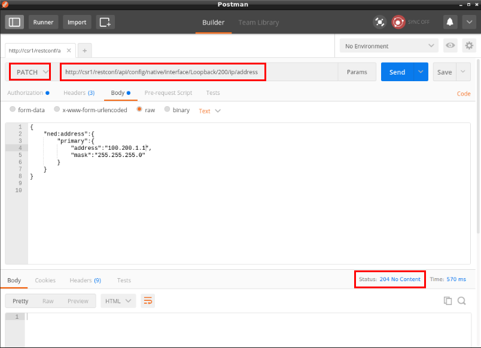

This time the request has been successfully completed with a **204** code. The reason is because **PATCH** is used to create or update a resource object.

##### Step 4

Repeat the same call of Step 3, but using **PUT** this time.

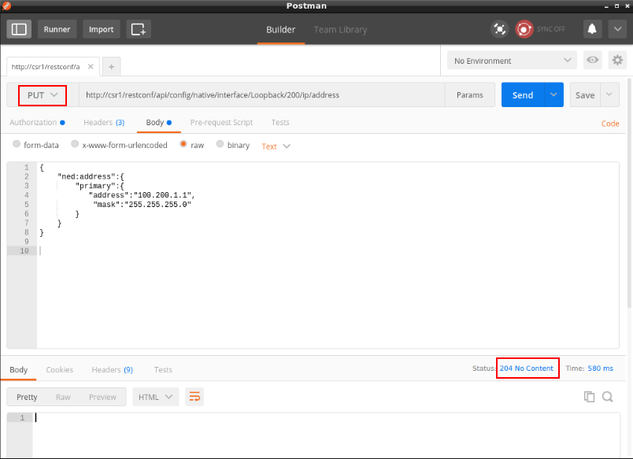

As you can see both secondary addresses are now gone. The reason is because **PUT** is used to create or **replace** a resource. 

You should be very careful when using PUT.  Instead, PATCH is a safer request type for just getting started.


##### Step 6

Verify again the Loopback200 configuration using **GET** as in Step 4. 

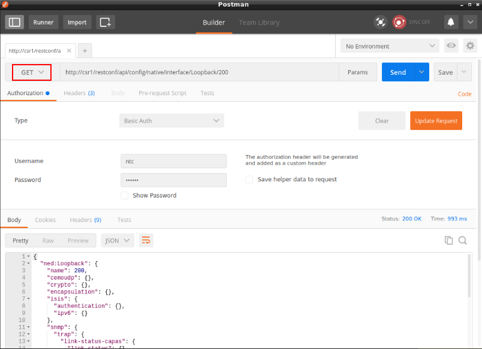


```
{
  "ned:Loopback": {
    "name": 200,
    "cemoudp": {},
    "crypto": {},
    "encapsulation": {},
    "isis": {
      "authentication": {},
      "ipv6": {}
    },
    "snmp": {
      "trap": {
        "link-status-capas": {
          "link-status": {}
        }
      }
    },
    "bfd": {},
    "bandwidth": {},
    "cdp": {},
    "mpls": {
      "accounting": {},
      "ldp": {},
      "traffic-eng": {
        "flooding": {}
      }
    },
    "ip": {
      "access-group": {},
      "arp": {
        "inspection": {}
      },
      "address": {
        "primary": {
          "address": "100.200.1.1",
          "mask": "255.255.255.0"
        }
      },
      "authentication": {},
      "nhrp": {
        "attribute": {},
        "map": {},
        "nhs": {
          "dynamic": {}
        }
      },
      "ospf": {
        "dead-interval": {},
        "fast-reroute": {}
      },
      "pim": {},
      "igmp": {},
      "dhcp": {
        "relay": {
          "information": {}
        },
        "snooping": {}
      },
      "rsvp": {},
      "verify": {
        "unicast": {}
      },
      "wccp": {
        "web-cache": {},
        "redirect": {}
      }
    },
    "ipv6": {
      "ospf": {
        "authentication": {
          "ipsec": {
            "md5": {},
            "sha1": {}
          }
        },
        "encryption": {
          "ipsec": {
            "ipsec_3des": {},
            "aes-cbc": {
              "aes-cbc-128": {},
              "aes-192": {},
              "aes-256": {}
            }
          }
        }
      },
      "nd": {}
    },
    "lisp": {
      "mobility": {}
    },
    "logging": {},
    "mls": {
      "qos-channel-consistency": {},
      "qos": {}
    },
    "ospfv3": {
      "authentication": {
        "ipsec": {
          "md5": {},
          "sha1": {}
        }
      },
      "encryption": {
        "ipsec": {
          "ipsec_3des": {},
          "aes-cbc": {
            "aes-cbc-128": {},
            "aes-192": {},
            "aes-256": {}
          }
        }
      },
      "manet": {
        "peering": {}
      }
    },
    "power": {},
    "interface_qos": {},
    "service-policy": {
      "type": {}
    },
    "standby": {},
    "storm-control": {
      "broadcast": {}
    },
    "wrr-queue": {},
    "priority-queue": {},
    "rep": {
      "block": {}
    },
    "peer": {
      "default": {
        "ip": {}
      }
    },
    "performance": {}
  }
}
```


